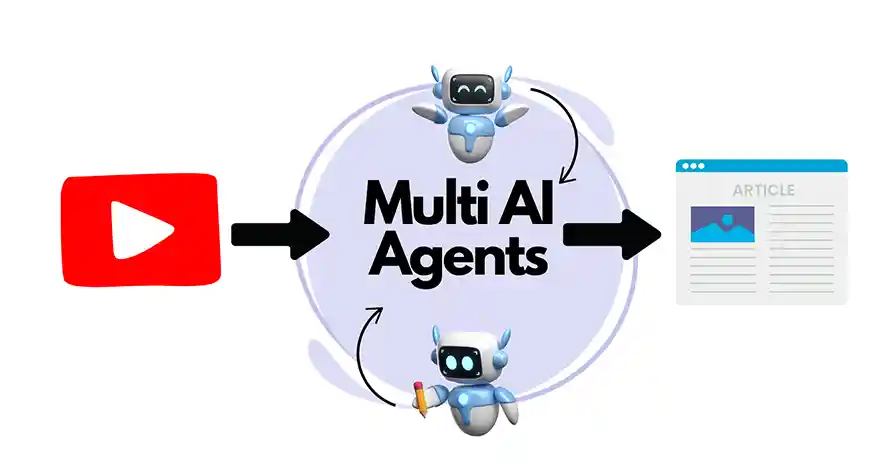

# 🧠 YouTube Video to Blog Generator using CrewAI

This project is an AI-powered multi-agent system that:

- Retrieves video content from a specific YouTube channel
- Extracts and processes transcripts
- Summarizes insights
- Converts them into well-structured, readable blog posts

<p align="center">
  
</p>

---

## 🔧 Tech Stack

This project uses the following components:

- 🤖 **CrewAI**: To manage multiple autonomous agents and their tasks
- 🧠 **HuggingFace models**: For generating embeddings using local or hosted models
- 🧲 **ChromaDB**: Vector store to semantically index and search through transcripts
- 🎥 **Embedchain (Ollama backend)**: To fetch and process YouTube video transcripts without relying on OpenAI

---

## 🚀 How to Run This Project

Below are the step-by-step instructions to set up and run the YouTube-to-Blog pipeline.

---

### ✅ Step 1: Create and Activate a Conda Environment

**Functionality**:  
Creating an isolated Python environment prevents conflicts with other projects and keeps dependencies clean.

```bash
conda create -n crewai_env python=3.11 -y
conda activate crewai_env
```
---
### ✅ Step 2: Install All Required Libraries

```bash
pip install requirementa.txt
```
---
### ✅ Step 3: Create a .env File to Store API Keys
In your project root, create a .env file:

```bash
touch .env
```
---
### ✅ Step 4: Modify config.yaml for YouTube Integration
**Functionality**:
This YAML file contains configuration used by embedchain to determine:

- Which model provider to use (e.g., HuggingFace or Ollama)

- What embedding model to load

- Which channel/handle to analyze on YouTube

---

### ✅ Step 5: Run the Multi-Agent System
```bash
python crew.py
```
